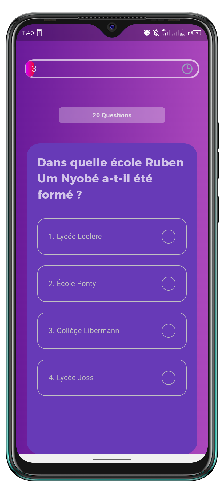

# 📱 Quiz Cameroun Histoire

Une application mobile de quiz interactive qui teste vos connaissances sur les grandes figures historiques du Cameroun.  
Construite avec **Flutter**, l'application propose une expérience ludique et éducative à travers des questions sur les personnages qui ont marqué l'histoire du Cameroun.

## ✨ Fonctionnalités

- 📝 Quiz sur l'histoire des personnages du Cameroun
- 📊 Score en temps réel
- 🎨 Interface intuitive et moderne
- ⚡️ Application rapide et fluide grâce à Flutter
- 🌍 Contenu 100% orienté culture camerounaise

## 🛠️ Technologies utilisées

- **Flutter** : Framework de développement cross-platform
- **Dart** : Langage de programmation
- **Provider** *(ou autre si tu utilises un autre state management)* : Gestion d'état
- **Firebase** *(optionnel si tu l’utilises)* : Backend / Authentification / Base de données

## 📸 Captures d'écran

*(Ajoute ici des captures d'écran de ton application pour illustrer l'interface)*


## 🚀 Installation

Clonez le projet et exécutez-le localement :

```bash
git clone https://github.com/votre-utilisateur/nom-du-repo.git
cd nom-du-repo
flutter pub get
flutter run

